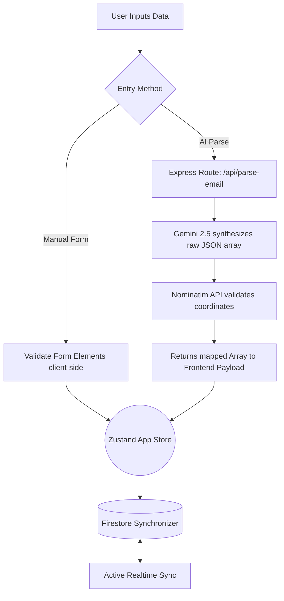
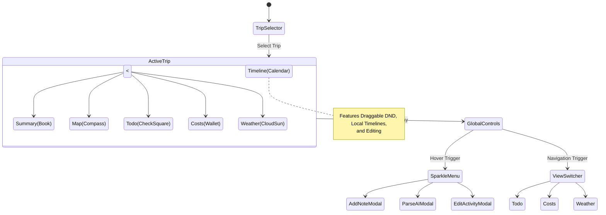

# Vacay Planning Application

**Vacay Planning** is a modern, high-performance, responsive travel planning and itinerary management application. It bridges the gap between chaotic trip planning and clean, actionable timelines by leveraging Apple iOS-styled design principles, real-time Firestore persistence, and advanced AI parsing tools to synthesize massive amounts of data into an elegant vacation outline.

---

## 🌟 Key Features

### 🔹 Modern Nav Controls
- **Minimalist Layout**: Icon-only floating menus (Sparkle Menu and View Switcher) for a clean, distraction-free aesthetic.
- **iOS-Inspired Aesthetics**: 60px glassmorphic buttons with spring-curved transitions and balanced 50/50 desktop split-view.
- **Pull-to-Refresh**: Native-feeling, elastic pull-down gesture across all primary screens (excluding Map) for manual data synchronization and tactical feedback.

### 🔹 AI Itinerary Ingestion
- **Email Parser**: Paste raw booking confirmations and Gemini 2.5 Flash will digest, categorize, and intelligently map them into your timeline.
- **Hotel Check-in Extraction**: Automatically identifies "Check-in after" and "Check-out by" times to ensure perfect arrival coordination.
- **Nominatim Geocoder**: Every AI-parsed location is silently validated against OpenStreetMap, resolving precise coordinates and snapping map routes instantly.

### 🔹 Dynamic Trip Outlining
- **Trip Synopsis**: Generate a beautifully written AI summary of your entire journey's vibe and destination trajectory with one click.
- **Balanced Desktop Split**: A 50/50 grid layout provides equal real-estate for the Timeline and Map on desktop screens.
- **Advanced Reordering**: Full drag-and-drop support for all items, including hotel check-outs and rental car returns, automatically recalculating routes and stay durations.

### 🔹 Leaflet Destination Mapping
- **Interactive Map**: Visualize your stops on a reactive vector map.
- **Dynamic Control**: The left-side Sparkle menu automatically hides in the map view to provide an unobstructed view of the map legend and navigation markers.
- **OSRM Pathfinding**: Automatically draws organic road-routing splines between Destinations in chronological order. Fixed logic re-calculates paths instantly upon itinerary changes.

### 🔹 Travel Power Modules
- **Todo System**: Trip checklists with due-date tracking, overdue highlighting, inline edit, and drag-to-reorder via grip handle.
- **Global Event Filtering**: Toggle visibility for specific categories (Flights, Hotels, Rentals, Activities, etc.) across both the Timeline and Map via the Sidebar to focus on specific trip segments.
- **Cost Tracker**: Comprehensive expense dashboard aggregating itinerary costs with paid/remaining split tracking and over-budget alerts.
- **Weather Suite**: Integrated daily forecasts via Open-Meteo API with **5-year historical precipitation averages** (rainfall + snowfall in inches) and daily H/L aggregated across all stops.
- **Enhanced Grouping**: Multi-leg flight grouping and automated rental car pickup/return cycle splitting.

### 🔹 Financial Management
- **Settlement Engine**: `paidAmount` field on itinerary items and manual expenses with over-budget detection (highlighted in red).
- **Deep Linking**: Clickable expense rows trigger itinerary editing directly from the Costs screen.
- **Prominent Summary**: Trip Financials header shows large total cost with Paid and Remaining breakdowns.
- **Global Orchestration**: Centralized modal management for consistent, cross-screen editing.

### 🔹 Climatic Intelligence
- **Historical Precipitation**: 5-year averaged rainfall and snowfall data (imperial units) replaces subjective condition labels.
- **Daily H/L Aggregation**: Timeline day headers display the range of high/low temps across all stops for that day.
- **Animated Refresh**: Spinning animation on the weather update button provides tactile feedback.

### 🔹 Glass UI & Themes
- **Glass Blue Buttons**: All primary actions use a frosted glass treatment instead of solid opaque blue.
- **10 Themes**: Default, Sunset, Midnight, Forest, Aurora, Desert Rose, Deep Ocean, Vulcan, Sakura, Cyberpunk — each with gradient swatch previews in the sidebar.
- **Ambient Background**: Three animated color blobs behind all content, colors driven by selected theme.

---

## 🏗️ Architecture Matrix

### 🖥️ Frontend (Web App)
- **Framework**: `React.js` via `Vite`
- **State Management**: `Zustand` (Global `useTripStore.ts`)
- **Routing**: `React Router v6`
- **Component Styling**: Extensive custom vanilla CSS mimicking iOS Human Interface Guidelines (Glassmorphism, spring curves).
- **Icons**: `Lucide-React`
- **Map Vector Engine**: `react-leaflet` / `leaflet`

### 🔧 Backend (Server & Database)
- **Service Chassis**: `Firebase Cloud Functions 2nd Gen`
- **Routing Engine**: `Express.js`
- **Database**: `Firebase Firestore` (NoSQL Realtime database)
- **Auth**: `Firebase Authentication` (Email / Credential flows)
- **AI Processing**: `@google/genai` (Gemini 2.5 Flash SDK)

### 🌍 Third-Party Interfacing APIs
- **Google Gemini API**: Synthesizes and extracts trip arrays and generates 1-paragraph trip outline synopses.
- **OpenStreetMap (OSM) / Nominatim**: Resolves plain text query addresses (e.g. "Space Needle") into reverse-geocoded precise decimals, protected by a recursive 1.2s delay logic to respect public DDoSing tolerances.
- **OSRM (Open Source Routing Machine)**: Fetches real-time driving paths drawing organic splines between mapping pins on the Destination timeline.

---

## 📦 Third-Party Software

### Frontend Libraries
- **React & Vite**: Core UI framework and lightning-fast development build tool.
- **Zustand**: Minimalist and high-performance state management for handling trip data globally.
- **Lucide React**: Beautifully crafted open-source icons for Apple-style UI semantics.
- **Leaflet & React-Leaflet**: Open-source mapping engine and its React wrapper for interactive destination pins.
- **React Router**: Industry-standard navigational routing and history management.
- **DND Kit**: Accessible, robust drag-and-drop primitives used for timeline reordering.
- **Firebase SDK**: Client-side library for seamless Firestore and Auth interactions.

### Backend Infrastructure
- **Express.js**: Fast, unopinionated web framework for Node.js powering the API layer.
- **Firebase Admin & Functions**: Cloud-native serverless environment for executing secure backend logic.
- **@google/genai**: Official SDK for low-latency interfacing with Gemini 2.5 models.
- **CORS**: Middleware for controlling secure cross-origin resource sharing between domains.
- **Dotenv**: Zero-dependency module that loads environment variables for security.
- **Jest & TS-Jest**: Comprehensive testing framework used for backend logic verification.

---

## 🗺️ Application Workflows & Diagrams

### User Input Pipeline
Whenever a user adds an activity, either through our rich-data modal or via the magical AI text extraction system, the lifecycle of that data scales linearly through our models before resolving gracefully on the frontend.



### Global UI Routing Diagram
The application centers around an abstract floating control module which manipulates overarching global routing and spawns contextual editing modalities.



---

## ⚙️ Development Initialization

**Requirements**: NodeJS `>= 18.x`, NPM

1. **Clone & Install**:
   ```bash
   # Terminal A - Webapp
   cd webapp
   npm install
   
   # Terminal B - Backend
   cd backend
   npm install
   ```
   
2. **Setup Environments Phase**:
   Ensure you duplicate `.env.example` inside `webapp` to `.env` and map your Firebase `VITE_FIREBASE_` config keys.
   Ensure you duplicate `.env.example` inside `backend` to `.env` and map your `GEMINI_API_KEY`.

3. **Start Servers**:
   ```bash
   # Terminal A - Webapp
   npm run dev
   
   # Terminal B - Backend
   npm run build:watch
   npm run dev
   ```

*(Note: Production rollouts leverage `firebase deploy` across hosting, functions, and firestore triggers.)*

---

### Phase 21 (v1.11.6): Stability & Premium Polish
- **Independent Event Reordering**: Introduced a decoupled sorting system for multi-day items (Hotels/Rentals). Check-in and check-out events now have independent sort orders, preventing "ghost movement" where reordering one event affected the other.
- **Enhanced Action Branding**: Color-coded the "My Trips" selector actions (White for Rename/Duplicate, Red for Delete) for faster recognition and semantic clarity.
- **Map Layout Recalibration**: Fixed split-screen centering by adding a `ResizeHandler` to trigger Leaflet's `invalidateSize()` during layout transitions.
- **Glass-Morphism Unification**:
  - Upgraded "My Trips" cards with high-blur, semi-transparent backgrounds and subtle highlights.
  - Standardized all primary "Add Trip" buttons (Sidebar & Selector) to the consistent blue glass style.
- **Robust Date Parsing**: Resolved cross-browser "Invalid Date" issues by implementing a safer string-reconciliation helper for ISO dates.
- **Rental Car Coloring**: Synchronized the Summary screen with the Timeline's purple theme for car segments.


### Phase 20 (v1.11.3): Trip Management & UI Polish
- **Centralized Admin**: Shifted Rename/Copy options to the Trip Selector and streamlined the Sidebar for purely navigation tasks.
- **Smart Itinerary Metadata**: Trip cards now feature automatic date-range calculation ("MMM D - MMM D, YYYY") for instant journey recognition.
- **Premium Styling Fixes**: Restored full transparency to the desktop split-view and perfected vertical alignment for iOS date inputs.

## 📺 Phase 17: UX Hardening & Visual Synchronization (v1.11.0)
- **Parallel Routing Engine**: Overhauled Map path calculation to use parallel OSRM fetches with 6s timeouts and cancellation logic, resolving the "Infinite Calculation" hang.
- **Desktop Scroll Fix**: Restored `overflow-y: auto` to the right-hand split-view panel for independent desktop scrolling.
- **Aesthetic Icon Refinement**: Replaced the emoji-based historical weather bargraph on the Summary page with the premium `BarChart3` icon.
- **Broken Icon Fix**: Resolved weather [?] question marks on the Summary outline by switching to emoji-compatible text spans.
- **Unified Button Ergonomics**: Swapped "Save" and "Cancel" on both Todo and Expense forms for consistent "Primary Action on Left" pattern.
- **Visual Unification**: Synchronized the Todo and Expense form cards with high-contrast elevated backgrounds and blue border highlights.
- **Definitive Date Scaling**: Applied robust overflow containment to all date inputs, resolving persistent iOS width overflow issues.
- **iOS Drag-to-Reorder Fix**: Implemented `e.preventDefault()` and `touch-action: none` for smooth Todo reordering.
- **Native Reordering Engine**: Successfully implemented `document.elementFromPoint` for bulletproof detection.
- **Sidebar Ergonomics**: Reordered utility sections and added a collapsible Appearance manager.

## 📺 Phase 16: UI Polishing & Feature Hardening (v1.9.5)
- **Inline Trip Renaming**: Added renaming capabilities directly within the Sidebar with real-time Firestore synchronization.
- **Financial Parity**: Standardized expense visualization by removing dimming on paid items and perfecting the currency alignment.
- **Improved Todo Experience**: Fixed date input scaling and overhauled the touch-based reordering engine with tactile feedback.
- **Contextual Labels**: Summary view now displays 'PICKUP' and 'RETURN' for rental car segments for better itinerary clarity.
