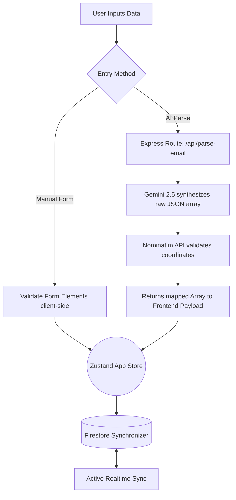
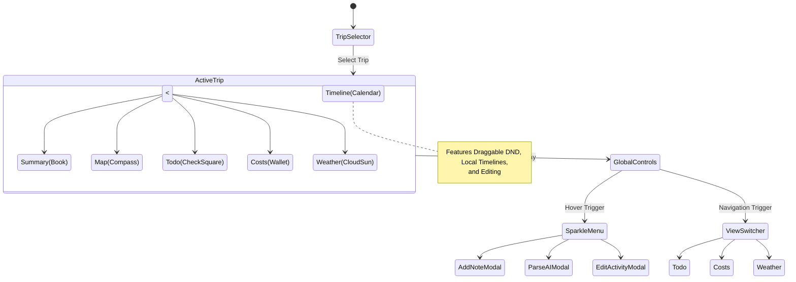

# Vacay Planning Application

**Vacay Planning** is a modern, high-performance, responsive travel planning and itinerary management application. It bridges the gap between chaotic trip planning and clean, actionable timelines by leveraging Apple iOS-styled design principles, real-time Firestore persistence, and advanced AI parsing tools to synthesize massive amounts of data into an elegant vacation outline.

---

## 🌟 Key Features

### 🔹 Modern Nav Controls
- **Minimalist Layout**: Icon-only floating menus (Sparkle Menu and View Switcher) for a clean, distraction-free aesthetic.
- **iOS-Inspired Aesthetics**: 60px glassmorphic buttons with spring-curved transitions and balanced 50/50 desktop split-view.

### 🔹 AI Itinerary Ingestion
- **Email Parser**: Paste raw booking confirmations and Gemini 2.5 Flash will digest, categorize, and intelligently map them into your timeline.
- **Hotel Check-in Extraction**: Automatically identifies "Check-in after" and "Check-out by" times to ensure perfect arrival coordination.
- **Nominatim Geocoder**: Every AI-parsed location is silently validated against OpenStreetMap, resolving precise coordinates and snapping map routes instantly.

### 🔹 Dynamic Trip Outlining
- **Trip Synopsis**: Generate a beautifully written AI summary of your entire journey's vibe and destination trajectory with one click.
- **Balanced Desktop Split**: A 50/50 grid layout provides equal real-estate for the Timeline and Map on desktop screens.
- **Advanced Reordering**: Full drag-and-drop support for all items, including hotel check-outs and rental car returns, automatically recalculating routes and stay durations.

### 🔹 Leaflet Destination Mapping
- **Interactive Map**: Visualize your stops on a reactive vector map.
- **Dynamic Control**: The left-side Sparkle menu automatically hides in the map view to provide an unobstructed view of the map legend and navigation markers.
- **OSRM Pathfinding**: Automatically draws organic road-routing splines between Destinations in chronological order. Fixed logic re-calculates paths instantly upon itinerary changes.

### 🔹 Travel Power Modules
- **Todo System**: Trip checklists with due-date tracking, overdue highlighting, inline edit, and drag-to-reorder via grip handle.
- **Global Event Filtering**: Toggle visibility for specific categories (Flights, Hotels, Rentals, Activities, etc.) across both the Timeline and Map via the Sidebar to focus on specific trip segments.
- **Cost Tracker**: Comprehensive expense dashboard aggregating itinerary costs with paid/remaining split tracking and over-budget alerts.
- **Weather Suite**: Integrated daily forecasts via Open-Meteo API with **5-year historical precipitation averages** (rainfall + snowfall in inches) and daily H/L aggregated across all stops.
- **Enhanced Grouping**: Multi-leg flight grouping and automated rental car pickup/return cycle splitting.

### 🔹 Financial Management
- **Unified Category System**: Car Rental, Flights, Gas, Dining, Lodging, Souvenirs, and Other.
- **Settlement Engine**: `paidAmount` field on itinerary items and manual expenses with over-budget detection (highlighted in red).
- **Deep Linking**: Clickable expense rows trigger itinerary editing directly from the Costs screen.
- **Category Summary Table**: A live breakdown of costs (Total, Paid, Remaining) per category for granular budget tracking.
- **Global Orchestration**: Centralized modal management for consistent, cross-screen editing.

### 🔹 Climatic Intelligence
- **Historical Precipitation**: 5-year averaged rainfall and snowfall data (imperial units) replaces subjective condition labels.
- **Daily H/L Aggregation**: Timeline day headers display the range of high/low temps across all stops for that day.
- **Animated Refresh**: Spinning animation on the weather update button provides tactile feedback.

### 🔹 Glass UI & Themes
- **Glass Blue Buttons**: All primary actions use a frosted glass treatment instead of solid opaque blue.
- **10 Themes**: Default, Sunset, Midnight, Forest, Aurora, Desert Rose, Deep Ocean, Vulcan, Sakura, Cyberpunk — each with gradient swatch previews in the sidebar.
- **Ambient Background**: Three animated color blobs behind all content, colors driven by selected theme.

---

## 🏗️ Architecture Matrix

### 🖥️ Frontend (Web App)
- **Framework**: `React.js` via `Vite`
- **State Management**: `Zustand` (Global `useTripStore.ts`)
- **Routing**: `React Router v6`
- **Component Styling**: Extensive custom vanilla CSS mimicking iOS Human Interface Guidelines (Glassmorphism, spring curves).
- **Icons**: `Lucide-React`
- **Map Vector Engine**: `react-leaflet` / `leaflet`

### 🔧 Backend (Server & Database)
- **Service Chassis**: `Firebase Cloud Functions 2nd Gen`
- **Routing Engine**: `Express.js`
- **Database**: `Firebase Firestore` (NoSQL Realtime database)
- **Auth**: `Firebase Authentication` (Email / Credential flows)
- **AI Processing**: `@google/genai` (Gemini 2.5 Flash SDK)

### 🌍 Third-Party Interfacing APIs
- **Google Gemini API**: Synthesizes and extracts trip arrays and generates 1-paragraph trip outline synopses.
- **OpenStreetMap (OSM) / Nominatim**: Resolves plain text query addresses (e.g. "Space Needle") into reverse-geocoded precise decimals, protected by a recursive 1.2s delay logic to respect public DDoSing tolerances.
- **OSRM (Open Source Routing Machine)**: Fetches real-time driving paths drawing organic splines between mapping pins on the Destination timeline.

---

## 📦 Third-Party Software

### Frontend Libraries
- **React & Vite**: Core UI framework and lightning-fast development build tool.
- **Zustand**: Minimalist and high-performance state management for handling trip data globally.
- **Lucide React**: Beautifully crafted open-source icons for Apple-style UI semantics.
- **Leaflet & React-Leaflet**: Open-source mapping engine and its React wrapper for interactive destination pins.
- **React Router**: Industry-standard navigational routing and history management.
- **DND Kit**: Accessible, robust drag-and-drop primitives used for timeline reordering.
- **Firebase SDK**: Client-side library for seamless Firestore and Auth interactions.

### Backend Infrastructure
- **Express.js**: Fast, unopinionated web framework for Node.js powering the API layer.
- **Firebase Admin & Functions**: Cloud-native serverless environment for executing secure backend logic.
- **@google/genai**: Official SDK for low-latency interfacing with Gemini 2.5 models.
- **CORS**: Middleware for controlling secure cross-origin resource sharing between domains.
- **Dotenv**: Zero-dependency module that loads environment variables for security.
- **Jest & TS-Jest**: Comprehensive testing framework used for backend logic verification.

---

## 🗺️ Application Workflows & Diagrams

### User Input Pipeline
Whenever a user adds an activity, either through our rich-data modal or via the magical AI text extraction system, the lifecycle of that data scales linearly through our models before resolving gracefully on the frontend.



### Global UI Routing Diagram
The application centers around an abstract floating control module which manipulates overarching global routing and spawns contextual editing modalities.



---

## ⚙️ Development Initialization

**Requirements**: NodeJS `>= 18.x`, NPM

1. **Clone & Install**:
   ```bash
   # Terminal A - Webapp
   cd webapp
   npm install
   
   # Terminal B - Backend
   cd backend
   npm install
   ```
   
2. **Setup Environments Phase**:
   Ensure you duplicate `.env.example` inside `webapp` to `.env` and map your Firebase `VITE_FIREBASE_` config keys.
   Ensure you duplicate `.env.example` inside `backend` to `.env` and map your `GEMINI_API_KEY`.

3. **Start Servers**:
   ```bash
   # Terminal A - Webapp
   npm run dev
   
   # Terminal B - Backend
   npm run build:watch
   npm run dev
   ```

*(Note: Production rollouts leverage `firebase deploy` across hosting, functions, and firestore triggers.)*

---

### Phase 45 (v1.19.0): Itinerary Refinement & Data Portability
- **Note Item Evolution**:
  - **Timeline UI**: Notes now display their `title` in the category badge and unconditionally show the `description` in the card body. The expanded view is streamlined to show only action buttons.
  - **Summary UI**: Suppressed "START" time labels for notes in the trip outline for a cleaner reading experience.
- **Route Engine Hardening**:
  - Implemented `AbortController` timeouts (10s) and robust error handling for OSRM routing.
### Phase 45 (Refinement & Portability):
- **Note Rendering**: Specialized `TimelineItem.tsx` logic to elevate note titles to badges and auto-expand descriptions.
- **Routing Robustness**: Added signal-based cancellation and 10s timeouts to `fetchOSRMRoute` in `MapViewScreen.tsx`.
- **Export Logic**: Introduced `exportUtils.ts` using a specialized CSV blobs/download approach for cross-platform compatibility.
- **AI Diagnostics**: Added background debug logging for the AI Summary generator to track synthesis success rates.

### Phase 44 (Action UI Refinement & Accessibility)
- **FAB Contrast & Visibility**:
  - Repositioned the Left Action FAB on narrow screens (from `24px` to `16px` offset) to prevent overlap with itinerary card icons.
  - Enhanced FAB visibility with a 2px white-ring border and high-opacity drop shadows to ensure they stand out against tinted backgrounds.
- **Modal UI Harmonization**:
  - Restyled the "Add Note" modal action button with the signature `btn-glass-blue` aesthetic, ensuring consistent visual language across all interactive modals.
  - Standardized disabled states with reduced opacity and subtle borders for better accessibility.
- **Icon Standardization**:
  - Replaced the legacy emoji icon in the "Add Note" button with a sleek Lucide `StickyNote` SVG, unifying the menu's professional aesthetic.

### Phase 43 (v1.17.0): Appearance Personalization - Tinted Backgrounds
- **Dynamic Background Logic**:
  - Introduced a global `tintedBackgrounds` setting accessible via the Appearance menu in the sidebar.
  - When enabled, itinerary item cards in the timeline dynamically adopt their category-specific theme color as a subtle background tint (e.g., green for hikes, orange for hotels).
  - Maintains full glassmorphism compatibility using translucent alpha-channel overlays.

### Phase 42 (v1.16.0): Look & Feel Refresh - Updated Palette
- **Itinerary Semantic Coloring**:
  - Re-mapped `Hotel` items to **Orange** (`#FF9F0A`) for improved visual distinctness against standard activities.
  - Re-mapped `Hike` items to **iOS Green** (`#30D158`), adopting the energetic tone previously used for check-ins.
  - Transformed `Generic Activities` to a **Whitish-Grey** (`#EBEBF5 / rgba(255,255,255,0.05)`), creating a more refined and hierarchical timeline.
- **Cross-Component Consistency**:
  - Synchronized the new color schema across the **Timeline**, **Summary View**, **Interactive Map Markers**, and **Cost Tracker** categories.

### Phase 41 (v1.15.0): AllTrails AI Intelligence & Map Integration
- **Google Search Grounding**:
  - Leveraged `@google/genai` with Native Search capability to dynamically bypass AllTrails bot blocking (403 limits).
  - Explicit prompt instructions forcefully compute trail `duration` based on Naismith's relative flat math.
  - Automatically fetches the explicit Start Address string and trailing Geocoordinates (Latitude / Longitude) directly into the Itinerary object.
- **Hiking Context Autofill**:
  - Quick-Paste box instantly populates the Activity Title, Location Box, Map Coordinates, Elevation, Distance, and Duration parameters for a pristine experience.

### Phase 40 (v1.14.0): General Trip Notes & External Map Routing
- **General Notes Ecosystem**: 
  - Created a dedicated `TripNote` data module for overarching Trip Notes (packing lists, links, contacts) unattached to specific dates.
  - Developed the `NotesScreen` with native drag-and-drop reordering, interactive `.glass-card` styling, inline edit flows, and inner-scroll bounds for lengthy notes.
  - Implemented `<Linkified>` URL interception forcing standard URLs out to new tabs.
  - Embedded navigation tab access deep into the `GlobalControls` unified Nav menu.
- **Dynamic External Routing**: 
  - Integrated `handleOpenMap` directly into the `Timeline` header bars to map out individual days.
  - Scans and distills items down to viable driving coordinates (stripping logic anomalies like `flights` and consecutive duplicates).
  - Yields high-precision `google.com/maps/dir/` universal link requests equipped with sequential `waypoints`, resolving natively on iOS and web correctly.

### Phase 39 (v1.13.0): High-Performance Map & Standardized Notes
- **Advanced Map Routing**:
  - **Universal Air Paths**: All flight segments correctly draw dashed lines. Connected the terminal leg to land perfectly on the destination marker.
  - **Self-Updating Cache**: Introduced `routeCache` tied to resolved geocoordinates. This provides instant visibility toggling while automatically invalidating stale paths when airports are found.
  - **Clustered Path Connectivity**: Added a mandatory 2-point fallback to ensure tightness between clustered items (e.g., airport rental drop-offs) always draw a visual line instead of failing OSRM.
  - **Synchronized Map Ordering**: Map explicitly respects manual drag-and-drop `sortOrder` overrides from the Timeline, prioritizing it over chronological timestamps.
- **Precision Geocoding Engine**:
  - Automatically queries Nominatim for missing destination airports on terminal flights.
  - Restricted to `countrycodes=us` and prioritizes specific IATA string formatting + explicit destination city names to stop major hub hijacking (e.g., JFK).
  - Virtual Arrival markers (`🛬` and `🏁`) perfectly respect day visibility filtering.
- **Dynamic Map Bounding**:
  - The programmatic `FitBounds` logic explicitly excludes coordinates of virtual landing markers if their parent day is hidden, maintaining perfect zoom framing.
- **Note & Todo System Standardization**:
  - Uniform neutral-grey, timeless itinerary notes. Simplified editing pane removing dates and times for pure note functionality.
  - Added optional multi-line `notes` functionality directly to Checklist tasks (Todos) with expandable inline-edit forms.
- **UX & DND Polish**:
  - Implemented 'sticky' `handleDrop` zones in Timeline ensuring if the blue target line is active, the touch drop will perfectly execute, acting less 'picky'.
  - Tripled the 'top-of-day' drop zone height (`24px`) to guarantee easy prepending of items to the start of a day.
  - Handled horizontal overflow description text ensuring action buttons remain visible.

### Phase 38 (v1.12.0): Financial Overhaul & Glass UI Maturity
- **Unified Expense Categories**: Replaced the fragmented "itinerary vs manual" categorization with a specific, unified system (Flights, Dining, Lodging, etc.).
- **Live Category Summary**: Implemented a collapsible financial dashboard at the top of the Expenses screen showing Total/Paid/Remaining per category.
- **Glass-Morphism Unification**: Extended the premium glass aesthetics to all items in the Trip Expenses and ToDo views, ensuring full visual consistency.

### Phase 21 (v1.11.6): Stability & Premium Polish
- **Independent Event Reordering**: Introduced a decoupled sorting system for multi-day items (Hotels/Rentals).
- **Map Layout Recalibration**: Fixed split-screen centering by adding a `ResizeHandler` to trigger Leaflet's `invalidateSize()` during layout transitions.
- **Robust Date Parsing**: Resolved cross-browser "Invalid Date" issues by implementing a safer string-reconciliation helper for ISO dates.
- Replaced the emoji-based historical weather bargraph on the Summary page with the premium `BarChart3` icon.
- **Sidebar Ergonomics**: Reordered utility sections and added a collapsible Appearance manager.

### Phase 20 (v1.11.3): Trip Management & UI Polish
- **Centralized Admin**: Shifted Rename/Copy options to the Trip Selector and streamlined the Sidebar for purely navigation tasks.

## 📺 Phase 17: UX Hardening & Visual Synchronization (v1.11.0)
- **Parallel Routing Engine**: Overhauled Map path calculation to use parallel OSRM fetches with 6s timeouts and cancellation logic.
- **Desktop Scroll Fix**: Restored `overflow-y: auto` to the right-hand split-view panel for independent desktop scrolling.

## 📺 Phase 16: UI Polishing & Feature Hardening (v1.9.5)
- **Inline Trip Renaming**: Added renaming capabilities directly within the Sidebar with real-time Firestore synchronization.
- **Financial Parity**: Standardized expense visualization by removing dimming on paid items and perfecting the currency alignment.
- **Improved Todo Experience**: Fixed date input scaling and overhauled the touch-based reordering engine with tactile feedback.
- **Contextual Labels**: Summary view now displays 'PICKUP' and 'RETURN' for rental car segments for better itinerary clarity.
